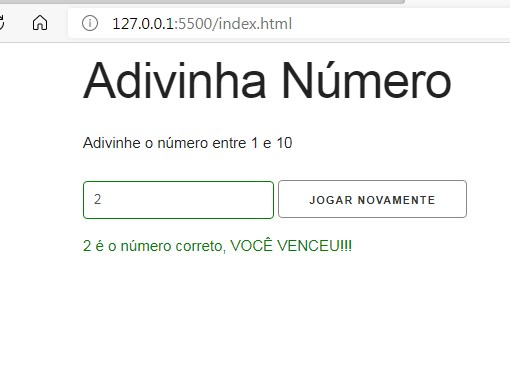

<h1 align="center">
  Number Guesser JavaScript
</h1>

## 📋 Índice

- [Preview](#-Preview)
- [Sobre](#-Sobre)
- [Tecnologias utilizadas](#-Tecnologias-utilizadas)
- [Como executar o projeto](#-Como-executar-o-projeto)

---

## 🖥 Preview

  

---

## 📖 Sobre 

Neste exercício foi criada um mini jogo para adivinhar um número entre um mínimo e um máximo. No jogo o jogador recebe uma quantidade de tentativas que são informadas conforme ele joga, se ele acertar qual era o número correto ele vence, caso ele não consiga advinhar o jogo informa qual era o número correto. Após o final do jogo ele tem a opção de jogar novamente. Exercício proposto para manipulação de DOM no curso "Modern JavaScript From The Beginning" do professor Brad Traversy. 

---

## 🚀 Tecnologias utilizadas
O projeto está sendo desenvolvido com as seguintes tecnologias:
- HTML5
- Skeleton
- JavaScript

---

## ⌨ Como executar o projeto

Baixe o arquivo .ZIP do projeto e após descompactar abra com seu navegador o arquivo index.html.

---